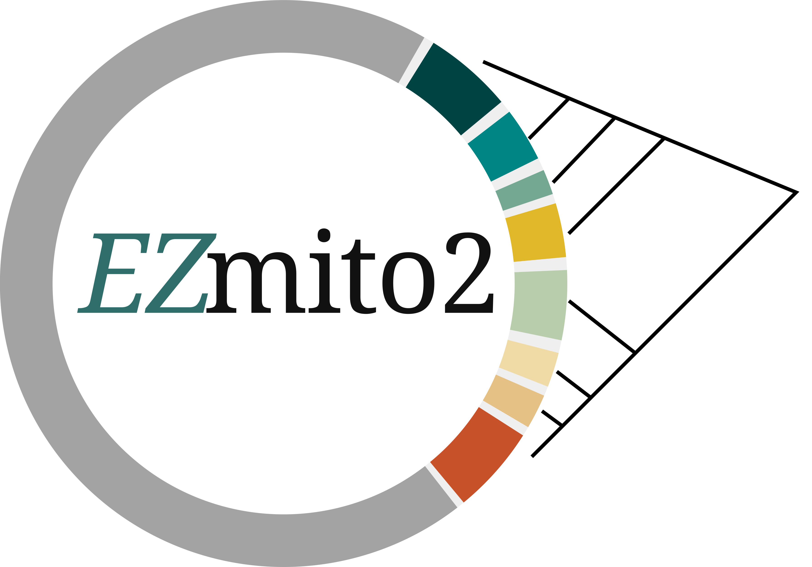

<div align="center">

# EZmito2 🧬


**A comprehensive toolkit for mitochondrial genome analysis**

[Features](#-features) • [Installation](#-installation) • [Usage](#-usage) • [Web Server](#-web-server) • [Citation](#-citation)

</div>

<p align="center">
  
</p>

---

## 🌟 Overview

**EZmito2** is a simple and fast command-line tool designed for comprehensive mitochondrial genome analyses. It provides a suite of eleven utilities for processing, analyzing, and visualizing mitochondrial DNA sequences with a focus on ease of use and efficiency.

Every tool writes a full `log.txt` to its output directory. If a run fails, a plain-language `error_report.txt` is also written there explaining what went wrong and how to fix it.

> 💻 **Web Server Available!** A parallel web-based version is available at [ezmito.unisi.it](http://ezmito.unisi.it)

---

## ✨ Features

EZmito2 includes eleven subcommands for mitochondrial genome analysis:

### 🔄 EZcircular
Rearrange a mitochondrial genome to start from a chosen gene.
- Accepts both **BED** and **GFF3** annotation files (format auto-detected and converted if needed)
- Supports circular and linear topologies
- Customizable starting gene

### 🧪 EZcodon
Codon usage and amino acid frequency analysis per strand.
- RSCU (Relative Synonymous Codon Usage) calculation
- Separate analysis for J (heavy) and N (light) strands
- Publication-ready plots
- Support for all standard mitochondrial genetic codes

### 📏 EZdist
Pairwise genetic distance matrix and heatmap from a pre-aligned FASTA.
- Distance models: p-distance, Kimura 2-Parameter (K2P), Tamura-Nei 93 (TN93)
- Pairwise or complete-deletion gap treatment
- CSV matrix + heatmap PDF output

### 🗺️ EZmap
Create circular or linear mitogenome maps from annotation files.
- Accepts both **GFF3** and **BED** annotation files
- Customizable heavy/light strand colours
- Publication-ready PDF output

### 🔍 EZmix
Detect potential chimeras in mitochondrial assemblies.
- All-vs-all BLASTn-based detection
- Adjustable identity and length thresholds
- Visual representation of homologous regions

### 📐 EZpca
PCA or PCoA ordination from a pre-aligned FASTA.
- SNP-matrix PCA or distance-based PCoA
- Optional population colouring via population map
- Scatter plots PDF + coordinates CSV output

### 🧬 EZpipe
Prepare mitochondrial sequences for phylogenetic analysis.
- Automated alignment with MAFFT
- Gblocks trimming
- Codon position filtering (2nd/3rd position)
- PartitionFinder configuration generation
- NEXUS and PHYLIP output

### 📊 EZpopstat
Population genetics statistics from a pre-aligned FASTA.
- Nucleotide diversity (π), segregating sites (S), Watterson's θ, Tajima's D
- Per-population statistics with optional population map
- Hierarchical AMOVA with optional group map
- Bar plots and CSV tables

### 📉 EZskew
Nucleotide skew analysis per codon position.
- AT%, AC%, GT% skew calculations
- Position-specific analysis (1st, 2nd, 3rd codon positions)
- Separate analysis for J (heavy) and N (light) strands
- Comprehensive tables and plots

### ✂️ EZsplit
Extract individual protein-coding genes from complete mitogenomes.
- Batch processing of multiple genomes
- GFF3-based gene extraction
- Automatic gene name standardization
- Missing gene detection

### 🔀 EZtrampo
Partition aligned mitochondrial PCGs into transmembrane, matrix, and inner membrane domains, following the [TRAMPO](https://github.com/dbajpp0/TRAMPO) pipeline.
- Domain boundary inference using reference models
- Support for custom reference organisms via user-supplied sequences and domain tables
- Nexus partition files by gene, codon position, and structural domain
- Composition plots and tables for skews, RSCU, and physicochemical properties

---

## 📋 Requirements

### System Requirements
- Linux/Unix-based operating system
- Conda (Miniconda or Anaconda)
- 4 GB RAM minimum
- 2 GB disk space

### Software Dependencies
All dependencies are automatically installed via the provided conda environment file. Key packages include:

- Python 3.7+
- Biopython
- pandas, numpy, matplotlib
- scikit-learn
- pyfiglet
- pycirclize
- BCBio
- itaxotools.pygblocks
- MAFFT
- BLAST+

---

## 🚀 Installation

### Quick Install (Recommended)

```bash
# Clone the repository
git clone https://github.com/ESZlab/EZmito2.git
cd EZmito2

# Run the installer
bash install.sh
```

The installer will:
1. ✅ Check if Conda is installed (and offer to install it if missing)
2. ✅ Create the `ezmito_env` conda environment
3. ✅ Install all required dependencies
4. ✅ Set up executable permissions

### Manual Installation

```bash
# Clone the repository
git clone https://github.com/ESZlab/EZmito2.git
cd EZmito2

# Make files executable
chmod 775 ezmito_env.yml ezmito.py

# Create and activate the conda environment
conda env create -f ezmito_env.yml
conda activate ezmito_env
```

### Verify Installation

```bash
conda activate ezmito_env
python ezmito.py --help
```

---

## 💻 Usage

Always activate the environment before running:
```bash
conda activate ezmito_env
```

### General Syntax
```bash
python ezmito.py <tool> [options]
python ezmito.py <tool> --help     # tool-specific help with full argument list
```

---

### 🔄 EZcircular

Rearrange a mitogenome to start from a different gene. Accepts BED or GFF3 annotation (auto-detected).

```bash
python ezmito.py ezcircular -i genome.fasta -b annotation.bed -s cox1 -o outdir/
python ezmito.py ezcircular -i genome.fasta -b annotation.gff3 -s cox1 -o outdir/
```

| Argument | Description | Default |
|---|---|---|
| `-i / --input` | Input FASTA file | **required** |
| `-b / --bed` | Annotation file: BED (6-column) or GFF3 | **required** |
| `-s / --start` | Starting gene name | `cox1` |
| `-f / --feature` | Genome topology: `circular` or `linear` | `circular` |
| `-o / --outdir` | Output directory | `outdir` |

**Outputs:** `output.fasta`, `output.bed`

---

### 🧪 EZcodon

```bash
python ezmito.py ezcodon -J heavy_genes/ -N light_genes/ -c 2 -o outdir/
```

| Argument | Description | Default |
|---|---|---|
| `-J / --heavy` | Directory of J (heavy) strand FASTA files | — |
| `-N / --light` | Directory of N (light) strand FASTA files | — |
| `-c / --code` | Genetic code number | **required** |
| `-o / --outdir` | Output directory | `outdir` |

> At least one of `-J` or `-N` is required.

**Outputs:** `plots/` (RSCU PDFs, AA frequency PDFs), `tables/` (RSCU CSV, AAfreq CSV)

---

### 📏 EZdist

```bash
python ezmito.py ezdist -i alignment.fasta -m k2p -p Blues -o outdir/
```

| Argument | Description | Default |
|---|---|---|
| `-i / --input` | Pre-aligned FASTA file | **required** |
| `-m / --model` | Distance model: `p`, `k2p`, `tn93` | `p` |
| `-g / --gap_treatment` | `pairwise` or `complete` deletion | `pairwise` |
| `-p / --palette` | Matplotlib colour palette for heatmap | `Blues` |
| `--show_values` | Annotate heatmap cells with values | off |
| `-o / --outdir` | Output directory | `outdir` |

**Outputs:** `distance_matrix.csv`, `distance_heatmap.pdf`

---

### 🗺️ EZmap

Accepts both GFF3 and BED annotation files (auto-detected).

```bash
python ezmito.py ezmap -g annotation.gff3 -f circular -colJ '#add8e6' -colN '#B22222' -o outdir/
```

| Argument | Description | Default |
|---|---|---|
| `-g / --gff` | Annotation file: GFF3 or BED | **required** |
| `-f / --feature` | Topology: `circular` or `linear` | `circular` |
| `-colJ / --colorJ` | J (heavy) strand colour | `#add8e6` |
| `-colN / --colorN` | N (light) strand colour | `#B22222` |
| `-o / --outdir` | Output directory | `outdir` |

**Outputs:** `circular_plot.pdf` or `mt_linear_output.pdf`

---

### 🔍 EZmix

```bash
python ezmito.py ezmix -i assemblies.fasta -id 0.97 -len 300 -o outdir/
```

| Argument | Description | Default |
|---|---|---|
| `-i / --input` | Multi-FASTA input file | **required** |
| `-id / --identity` | Minimum identity threshold (0.5–1) | `0.95` |
| `-len / --length` | Minimum hit length (bp) | `200` |
| `-bn / --blastn` | Path to BLASTn executable directory | system PATH |
| `-o / --outdir` | Output directory | `outdir` |

**Outputs:** `<input>_output.pdf`

---

### 📐 EZpca

```bash
python ezmito.py ezpca -i alignment.fasta --popmap popmap.txt --method pca -n 3 -p Set1 -o outdir/
```

| Argument | Description | Default |
|---|---|---|
| `-i / --input` | Pre-aligned FASTA file | **required** |
| `--popmap` | Tab-separated population map (sample, population) | — |
| `--method` | `pca` (SNP matrix) or `pcoa` (distance-based) | `pca` |
| `--dist_model` | Distance model for PCoA: `p` or `k2p` | `p` |
| `-n / --n_components` | Number of principal components | `3` |
| `-p / --palette` | Matplotlib colour palette | `Set1` |
| `-o / --outdir` | Output directory | `outdir` |

**Outputs:** `PCA_plot.pdf` (or `PCOA_plot.pdf`), `PCA_coordinates.csv`

---

### 🧬 EZpipe

```bash
python ezmito.py ezpipe -i genes/ -c 2 -p 3 -o outdir/
```

| Argument | Description | Default |
|---|---|---|
| `-i / --input` | Directory of per-gene FASTA files | **required** |
| `-c / --code` | Genetic code number | **required** |
| `-p / --positions` | Codon positions: `2` (remove 3rd) or `3` (keep all) | `3` |
| `-o / --outdir` | Output directory | `outdir` |

**Outputs:** `infile.phy`, `partition_finder.cfg`

---

### 📊 EZpopstat

```bash
python ezmito.py ezpopstat -i alignment.fasta --popmap popmap.txt --n_perms 999 -o outdir/
```

| Argument | Description | Default |
|---|---|---|
| `-i / --input` | Pre-aligned FASTA file | **required** |
| `--popmap` | Tab-separated population map (sample, population) | — |
| `--groupmap` | Tab-separated group map (population, group) — enables hierarchical AMOVA | — |
| `--n_perms` | Permutations for AMOVA p-values: `9999`, `999`, or `0` (skip) | `999` |
| `-o / --outdir` | Output directory | `outdir` |

**Outputs:** `population_statistics.csv`, `pi_per_population.pdf`

---

### 📉 EZskew

```bash
python ezmito.py ezskew -J heavy_genes/ -N light_genes/ -c 2 -o outdir/
```

| Argument | Description | Default |
|---|---|---|
| `-J / --heavy` | Directory of J (heavy) strand FASTA files | — |
| `-N / --light` | Directory of N (light) strand FASTA files | — |
| `-c / --code` | Genetic code number | **required** |
| `-o / --outdir` | Output directory | `outdir` |

> At least one of `-J` or `-N` is required.

**Outputs:** `tables/Final_table.csv`, `plots/First_and_second_bias.pdf`, `plots/Third_bias.pdf`

---

### ✂️ EZsplit

```bash
python ezmito.py ezsplit -i mitogenomes.fasta -g annotation.gff3 -o outdir/
```

| Argument | Description | Default |
|---|---|---|
| `-i / --input` | Multi-FASTA of complete mitogenomes | **required** |
| `-g / --gff` | GFF3 annotation file | **required** |
| `-o / --outdir` | Output directory | `outdir` |

**Outputs:** one FASTA per gene (e.g. `cox1.fasta`), `missing_genes.txt`

---

### 🔀 EZtrampo

```bash
python ezmito.py eztrampo -p genes/ -c 2 -m hsa -g vert -n 4 -o outdir/
```

| Argument | Description | Default |
|---|---|---|
| `-p / --path` | Directory of per-gene FASTA files | **required** |
| `-c / --code` | Genetic code number | **required** |
| `-m / --model` | Model organism nickname (see table below) | **required** |
| `-g / --gene_order` | Gene order model: `vert`, `panc`, `ances`, `albin`, `meta` | — |
| `-n / --threads` | MAFFT threads | `1` |
| `-s / --sequence` | Custom model organism amino acid FASTA (requires `-t`) | — |
| `-t / --tables` | Custom TMHMM table files directory (requires `-s`) | — |
| `-o / --outdir` | Output directory | `outdir` |

**Outputs:** `plots/`, `tables/`, `stats/`, `partitions/`

**Model organisms:**

| Nickname | Species | Taxon |
|---|---|---|
| `hsa` | *Homo sapiens* | Chordata |
| `ppe` | *Patiria pectinifera* | Echinodermata |
| `dme` | *Drosophila melanogaster* | Pancrustacea + Chelicerata |
| `aca` | *Albinaria caerulea* | Mollusca |
| `lte` | *Lumbricus terrestris* | Annelida |
| `cel` | *Caenorhabditis elegans* | Nematoda — note: lacks ATP8 |
| `mse` | *Metridium senile* | Cnidaria |
| `user` | Custom | Requires `-s` and `-t` |

---

## 📋 Genetic Code Reference

| Code | Name |
|---|---|
| `2` | Vertebrate Mitochondrial |
| `3` | Yeast Mitochondrial |
| `4` | Mold, Protozoan, Coelenterate Mitochondrial |
| `5` | Invertebrate Mitochondrial |
| `9` | Echinoderm and Flatworm Mitochondrial |
| `13` | Ascidian Mitochondrial |
| `14` | Alternative Flatworm Mitochondrial |
| `16` | Chlorophycean Mitochondrial |
| `21` | Trematode Mitochondrial |
| `22` | *Scenedesmus obliquus* Mitochondrial |
| `23` | *Thraustochytrium* Mitochondrial |
| `33` | Cephalodiscidae Mitochondrial UAA-Tyr |

---

## 📊 Population & Group Map Format

Used by **EZpca** and **EZpopstat**. Plain tab-separated text files.

**Population map** (`--popmap`):
```
Taxon1	PopulationA
Taxon2	PopulationA
Taxon3	PopulationB
Taxon4	PopulationB
```

**Group map** (`--groupmap`, for hierarchical AMOVA in EZpopstat):
```
PopulationA	Group1
PopulationB	Group2
```

> Sequence names must exactly match the FASTA headers (case-sensitive).

---

## 📂 Log and Error Files

Every tool writes to its output directory:

- **`log.txt`** — Full run log: pyfiglet banner, all parameters, step-by-step progress, and total runtime. Always written, even on failure.
- **`error_report.txt`** — Created **only on failure**. Opens with a large `ERROR` banner, explains in plain language what went wrong and how to fix it, then includes the full Python traceback for support. Start here when a run fails.

---

## 🌐 Web Server

Don't want to use the command line? Try our **user-friendly web interface** at:

### [🔗 ezmito.unisi.it](http://ezmito.unisi.it)

The web server provides:
- ✅ No installation required
- ✅ Intuitive graphical interface
- ✅ Example datasets
- ✅ Direct download of results
- ✅ Job management system

---

## 🛠️ Troubleshooting

**"Conda not found"**
```bash
# Install from: https://docs.conda.io/en/latest/miniconda.html
# Or let the installer handle it automatically.
```

**"Environment already exists"**
```bash
conda env remove -n ezmito_env
conda env create -f ezmito_env.yml
```

**"Permission denied"**
```bash
chmod 775 install.sh ezmito.py
```

**A run failed — what do I do?**

Open `error_report.txt` in the output directory first. It is written for non-technical users and usually tells you exactly which file needs to be fixed and how. If the cause is still unclear, attach both `error_report.txt` and `log.txt` when opening a GitHub issue.

---

## 📖 Citation

If EZmito2 helps your research, while waiting for the new manuscript please cite:

> **Cucini C., Leo C., Iannotti N., Boschi S., Brunetti C., Pons J., Fanciulli P. P., Frati F., Carapelli A., & Nardi F. (2021)**
> *EZmito: a simple and fast tool for multiple mitogenome analyses*
> Mitochondrial DNA Part B, 6(3), 1101–1109.
> DOI: [10.1080/23802359.2021.1899865](https://doi.org/10.1080/23802359.2021.1899865)

---

## 📝 License

This project is licensed under the GNU General Public License v3.0 — see the `LICENSE` file for details.

---

## 👥 Authors

Cucini C., Leo C., Iannotti N., Boschi S., Brunetti C., Pons J., Fanciulli P. P., Frati F., Carapelli A., & Nardi F.

---

## 🐛 Issues & Support

Found a bug or need help? Please open an issue on our [GitHub Issues page](https://github.com/ESZlab/EZmito2/issues) and attach `log.txt` and `error_report.txt` from the failed run.

---

<div align="center">

⭐ Star us on GitHub if you find EZmito2 useful!

</div>
